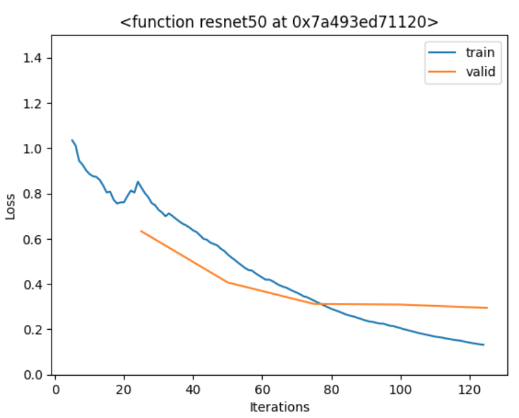
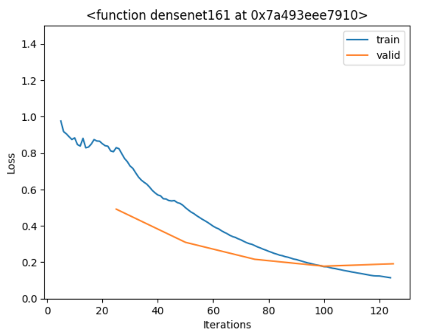
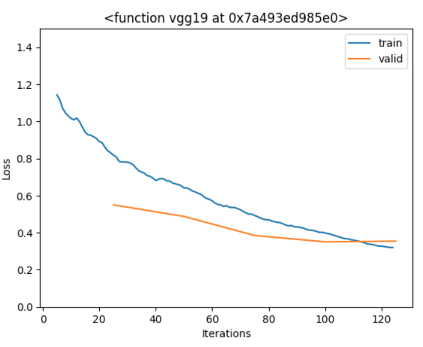

# ai image detection architecture review
Various architectures were tested. Most architectures tested were designed to fix what is known as the "vanishing gradient problem". this is a problem encountered when trying to deepen CNNs with more layers. Eventually, adding more layers causes feature gradients to approach zero, becoming useless.

## ResNet

ResNet is a very popular backbone for image classification. Where other models learn the features of the data, ResNet aims to learn residual values which eliminates vanishing gradients.

## DenseNet

DenseNet is also a well-performing backbone in literature. It makes liberal use of fully-connected layers in a CNN, known also as Dense layers. This is an alternative solution to the vanishing gradient problem, and allows DenseNet models to have very deep feature-recognition. 

## VGG

VGG networks are made up of consecutively shrinking convolutional building blocks. The building blocks have convolutional filters, and pooling layers. It is used very frequently for image classification.

